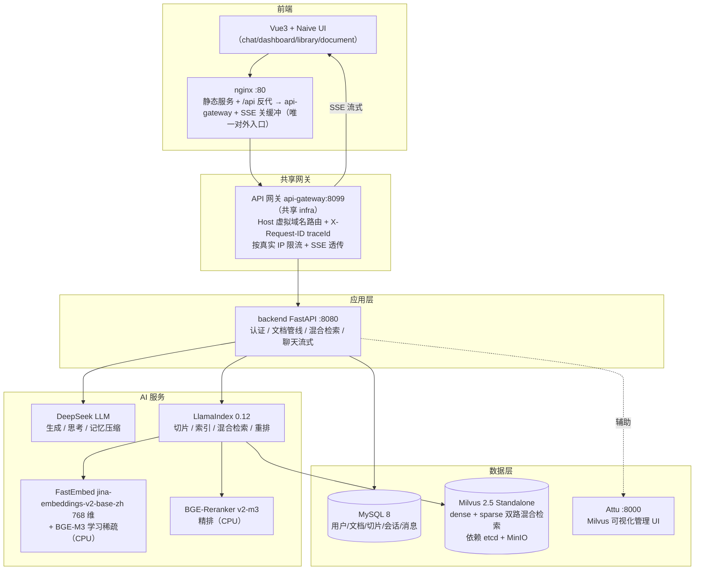

# 不懂就问（Native RAG）

> **多用户 RAG 文档问答系统**：文档上传即自动抽取 → 清洗 → 切片 → 向量化，之后基于文档库提问，大模型用**带来源标注、流式返回**的答案作答。私有知识有出处、可溯源、不编造，会话与文档库双隔离。

第一次接触这个项目，只看下面三句就够了：

- **做什么**：把私有文档变成可问答的知识库。上传的每份文档都被自动切成片段并向量化，你只需像聊天一样提问，模型**只基于你的文档作答，答必带引用出处**。
- **怎么做**：**LLM 自主决定是否检索**（function calling 编排）→ 命中检索则**混合检索 + 重排 + 置信分级** → 大模型带来源流式作答；规则护栏在"该查不查"和"查不到就编"两个口子上兜底。
- **好在哪**：答必有据、不编造、多用户隔离、首包秒回；对外是契约对齐的 SSE 事件流，有 178 项单元测试 + 运行时契约验证脚本，开箱即验。

## 目录

- [一、这是什么](#一这是什么)
- [二、系统架构](#二系统架构)
- [三、快速开始](#三快速开始)
- [四、使用场景与示例](#四使用场景与示例)
- [五、技术闪光点](#五技术闪光点)
- [六、技术栈一览](#六技术栈一览)
- [七、配置说明](#七配置说明)
- [八、目录结构](#八目录结构)
- [九、测试与验收](#九测试与验收)
- [十、开发指南](#十开发指南)
- [十一、常见问题](#十一常见问题)
- [十二、已知限制与优化方向](#十二已知限制与优化方向)
- [十三、版本记录](#十三版本记录)

---

## 一、这是什么

用大模型回答"你私有的文档"这件事，常见的坑有四个：

- **私有文档问不到**：公司政策、产品手册、合同条款散落在文档里，大模型训练数据里根本没有——直接问必然瞎编；
- **答案没出处**：就算答了，也说不出依据哪段原文，无法核验、无法追责；
- **知识无法隔离**：多人共用一套知识库，A 问到的内容串到 B 的库里，出了事找不到是谁泄露的；
- **等不起**：文档多、上下文大，普通请求要几十秒才回，用户没有耐心。

本系统针对这四个痛点，提供四个核心能力：

| 能力 | 实现 | 对应痛点 |
|------|------|---------|
| **私有文档知识化** | 上传即自动抽取 → 清洗 → 切片 → 向量化，问答只基于你上传的内容 | 私有文档问不到 |
| **带溯源问答** | 混合检索（语义 + BGE-M3 稀疏 + Rerank）+ DeepSeek 生成，答案用 `[来源N]` 标注引用 | 答案没出处 |
| **多用户隔离** | 文档库 + 会话双隔离，归属后端强制校验，普通用户 API 层也拿不到他人数据 | 知识无法隔离 |
| **流式体验** | SSE 逐字返回，思考过程单独折叠展示，首包秒回、不干等 | 等不起 |

> **一句话理解 RAG**：RAG（Retrieval-Augmented Generation，检索增强生成）= 先从你的私有文档里检索出最相关的片段，再让大模型基于这些片段回答。这样大模型就能回答"它的训练数据里根本没有"的私有内容，且答案有出处、可溯源、不凭空编造。

---

## 二、系统架构



**对外链路（统一 API 网关）**：浏览器只访问前端 nginx；nginx 将 `/api` 反代到共享网关 `api-gateway:8099`（`Host: gq.local`），网关按 Host 虚拟域名路由到本 agent 后端，并生成 `X-Request-ID`（后端日志 `trace_id` 即此值）、按真实 IP 限流、SSE 透传。网关由共享 infra 仓库提供（`infra/api-gateway/`），未知 Host 一律 403 防串线。宿主端口映射的 backend 地址（如 `localhost:8080`）仅供开发调试 / 评测直连，绕过网关。

### 编排模式：LLM 自主决策 + 规则护栏

本系统**不是**"先检索、后作答"的固定流程，而是让 LLM 自主决定"要不要查文档"，再由规则在三个关键口子上兜底：

1. **LLM 自主决策**：第一轮带 `hybrid_retrieve` 工具，由 LLM 判断这个问题是否需要查库——需要则生成检索 query 并调用工具；不需要则直接作答（不强制检索，闲聊/纯知识类问题不浪费检索）。
2. **规则否决权（F3）**：LLM 决定"不查"，但规则判定该问题属于文档事实类（`rule_intent ∈ {query, unknown}`）→ **规则强制检索**，拦住"该查不查导致编造"。纯计算 / 常识类问题豁免（不否决、不误提示）。
3. **空结果规则兜底**：检索为空时按意图分类走固定话术——事实类 → 如实回答"文档中未找到相关信息"（**不调用 LLM**，从源头杜绝空 context 编造）；意图不明 → 引导澄清；问候 → 交 LLM 引导寒暄。

一句话概括：**LLM 负责"怎么答"，规则负责"必须查的别漏查、查不到的别编造"。**

### 一次问答的完整链路

以下按"LLM 决定检索"的路径描述；LLM 决定不检索时跳过 ②-④ 直接作答，F3 规则否决发生时强制进入 ②：

```
用户提问
  → ① LLM 第一轮自主决策  带 hybrid_retrieve 工具判断是否需要查库（不查 → 直接作答）
  → ② 混合检索             LlamaIndex hybrid_search：dense 语义 top-k + BGE-M3 稀疏 top-k
                           （library_id 字段级过滤限定库，RRF 融合去重，取 top-6 候选）
  → ③ Rerank 精排          BGE-Reranker 对候选逐段打分，按分数倒序取 top-3
  → ④ 置信分级             最高分 < 0.2 → 判"文档无关"返回空；
                           最高分 ∈ [0.2, 0.5) → 判"相关性存疑"，结果照常进 LLM 但追加兜底提示
  → ⑤ 组装 prompt          检索片段 + 最近 3 轮历史 + 摘要
  → ⑥ 直连 DeepSeek 流式生成（reasoning_content 思考 + content 正文 + usage）
  → ⑦ SSE 事件序           meta → reasoning* → [tool_call → sources]? → reasoning*/token* → usage → done
  → ⑧ 前端按序渲染         溯源卡片 → 思考折叠 → 逐字答案 → 完成
```

---

## 三、快速开始

> ⚠️ **前置依赖：共享 infra**。本 agent **不自带任何中间件**（MySQL / Redis / Milvus / BGE-M3 等），运行前须先部署共享 infra 仓库：
>
> ```bash
> # 发布物：clone infra 独立仓库后启动
> git clone https://github.com/zhanggy1984/share-infra && cd infra && docker compose up -d
> # 本地开发：infra 位于 ../infra
> cd ../infra && docker compose up -d
> ```

前置：Docker Desktop（Linux 容器）、Python 3.11（跑宿主机验证脚本用）。

### 第 1 步：配置环境变量

```bash
cp .env.example .env
# 编辑 .env，至少填写：
#   DEEPSEEK_API_KEY=sk-xxx        # DeepSeek API Key（问答必需）
#   ADMIN_PASSWORD=xxx             # 管理员密码（务必修改）
#   JWT_SECRET_KEY=xxx             # JWT 签名密钥（建议修改）
#   MINERU_API_TOKEN=              # 可选；留空用本地解析，填了走 MinerU 官方 API
```

### 第 2 步：启动应用容器（backend + nginx）

```bash
docker compose up -d
# 首次含镜像构建（torch CPU + MinerU 依赖，体积 8-12GB、耗时数十分钟）
docker compose ps                 # rag-backend / rag-nginx 全部 Up + healthy
curl localhost:8080/api/health    # {"status":"ok","service":"Native RAG"}
```

> 本 agent 只起应用容器；MySQL/Redis/Milvus 全在共享 infra（库 `native_rag`、redis db/2、collection `rag_chunks`）。

### 第 3 步：访问

```bash
open http://localhost:8089    # 浏览器前端（nginx 8089 端口）
open http://localhost:38000   # Attu：Milvus 可视化管理 UI（共享 infra）
```

**默认账号**（首次启动自动创建，强烈建议改密码）：

| 角色 | 账号 | 密码 |
|------|------|------|
| 管理员 | `ADMIN_USERNAME`（.env，默认 `admin`） | `ADMIN_PASSWORD`（.env，默认 `change_me_admin`） |
| 普通用户 | 登录页点"去注册"自助注册 | — |

> ⚠️ **资源占用**：backend 镜像含 PyTorch(CPU) + MinerU + 模型，约 8-12GB；Milvus Standalone + etcd + MinIO 内存占用约 2-4GB，建议宿主机内存 ≥ 8GB。模型缓存挂载在 volume，重启不重复下载。

---

## 四、使用场景与示例

### 4.1 给谁带来什么

**对管理员（内容运营，admin）**
- **建库传文档**：一个文档库一个主题，文档按库组织；每篇文档可**独立设置切分参数**（chunk 长度 / 重叠 token），大 PDF 用 1024、短说明用 512，按文档自身配置切分；
- **进度可见**：上传后异步处理，处理中实时显示"已处理 N 段"，完成变"就绪"，点开可预览全部切片确认切分质量；
- **级联清理**：删除文档库时文档、切片、向量、全文索引一并清理，不留脏数据。

**对普通用户（user）**
- **只问答，不管理**：登录后只看到"聊天问答"，仪表盘、文档库菜单均不显示，改 URL 也会被前端路由守卫重定向；
- **会话制问答**：绑定一个文档库，可创建/删除多个会话，会话之间完全隔离；
- **看得见的过程**：答案带溯源卡片（文档名 / 标题路径 / 片段序号 / 片段预览）+ 思考过程折叠展示，不是黑盒结论；
- **如实回答**：文档里没有的，明确说"文档中未找到相关信息"，绝不编造。

**对评测 / 验收方**
- **接口自动发现**：公开 `GET /api/contracts` 声明本 agent 的 LLM 接口与场景清单，平台脚手架直接读取，无需人工配置；
- **契约对齐**：LLM 自主决定是否检索（function calling 编排），SSE 事件流严格对齐评测契约（`meta`/`tool_call`/`usage` + 全事件 `ts`），`reasoning`/`token` 双字段兼容前端与评测侧，`usage` 透传真实 token 消耗；
- **一键验证**：`python verify_contract.py` 运行时验证完整事件流，字段缺失、顺序错误立即暴露。

### 4.2 一键造数

> 示例数据**客观可复现**：`test-data/seed_example.py` 一键重建"示例知识库"（删旧库 → 上传 4 份中文文档 → 等就绪 → 打印问题清单）。示例文档用 `.md`（抽取走明文读取，无需 MinerU），容器就绪即可秒级造数。

```bash
docker compose up -d                   # 7 服务就绪（首次构建较久）
python test-data/seed_example.py       # 登录 → 重建示例库 → 上传 4 份文档 → 等就绪 → 打印问题清单
open http://localhost                  # admin 登录 → 聊天页选"示例知识库" → 复制场景问题提问
```

幂等可重跑：重复执行会删除已存在的示例库并重建（会话/文档/向量级联清理），结果一致。

> ⚠️ 示例/验证脚本默认以 `admin / admin123` 登录（`config.py` 默认值）；若已修改 `ADMIN_PASSWORD`，请用环境变量 `RAG_ADMIN_USER` / `RAG_ADMIN_PASS` 覆盖后运行。

### 4.3 6 个示例场景

| 场景 | 提问（复制即用） | 预期 | 观看点 |
|------|------------------|------|--------|
| **1 · 事实问答** | 公司规定请事假需要提前几天申请？ | 答案命中考勤制度，带 `[来源N]` | 溯源卡片显示"员工考勤管理制度 > 请假管理"标题路径 |
| **2 · 技术检索** | Docker 的常用命令有哪些？ | 答案列出手册中的命令 | 答案逐字流式 + 思考过程折叠 |
| **3 · 无命中兜底** | 工资发放日是几号？ | 文档未写，如实回答"文档中未找到相关信息" | **不出现空引用卡片**（两级置信档下不编造） |
| **4 · 跨文档总结** | 分别用一句话总结四份文档的核心内容 | 答案基于多份文档总结 | 溯源卡片含多份文档来源 |
| **5 · 闲聊引导** | 你好 | 助手自我介绍并引导提问 | 问候不检索、不编造"文档查到" |
| **6 · 多轮追问** | 请事假扣工资吗？→ 年假有几天？→ 缺勤会怎样？ | 连续追问上下文连贯 | 提问超 10 轮自动压缩记忆，长对话不串味 |

### 4.4 评测场景（契约声明）

`GET /api/contracts` 声明的 4 个评测场景是**行为契约**（平台据此出题），与上述业务示例一一对应：

| 契约标签 | 对应示例 |
|---------|---------|
| `greeting` 问候闲聊 | 场景 5 |
| `doc_qa` 文档检索问答 | 场景 1 / 2 / 6 |
| `no_hit` 无命中兜底 | 场景 3 |
| `summarize` 文档总结 | 场景 4 |

**验收示例**（对运行中的服务）：

```bash
python verify_contract.py           # 契约事件流验证（meta → reasoning/token → [tool_call → sources]? → usage → done）
python test-data/e2e.py             # 端到端：登录→建库→上传→轮询就绪
python test-data/chat.py            # chat 完整链路：登录→建会话→提问→读 SSE 事件
```

---

## 五、技术闪光点

### 1. LlamaIndex 统一混合检索：双存储合一
检索存储从 **ChromaDB（语义）+ Elasticsearch（全文）双存储**，迁移为 **Milvus 2.5 Standalone 单存储**，并由 **LlamaIndex 0.12** 统一托管：dense 语义（FastEmbed 768 维）+ **BGE-M3 学习稀疏**（替代服务端 BM25，query 与文档两端都编码，语义召回更准）在同一 collection 内混合检索，RRF 融合去重，**library_id 字段级过滤**做文档库隔离（替代 partition），可横向扩展。配套 `scripts/migrate_to_milvus.py` 幂等重灌脚本（按文档先删后灌，可重复执行）与 `test-data/verify_old_data.py` 迁移验证，升级不丢失数据。

### 2. 两级置信档：防幻觉，也不误杀
实测 Rerank 的**绝对分数不可靠**——最相关的片段可能只得 0.27 分，用绝对阈值会误杀（曾导致"明明检索到了却返回空"）。因此：

- **相对排序取 top-3**，不做绝对阈值过滤；
- **最高分 < 0.2**（`SIMILARITY_THRESHOLD_LOW`）判"文档无关"，返回空、不发空引用；
- **未命中不调 LLM**：实测空 context 下 DeepSeek 会**稳定编造**"合理答案"（曾把文档未提到的"工资发放日"编成每月 10 号），故检索为空时用 `_is_smalltalk()` 区分意图——**事实类查询直接返回固定"未找到"话术、不调用 LLM**（编造概率归零），仅问候/闲聊继续走 LLM 引导话术（带问候前缀的查询如"你好，工资几号发"不会被误判）；
- **最高分 ∈ [0.2, 0.5)**（`RERANK_LOW_CONFIDENCE_THRESHOLD`）判"相关性存疑"——检索结果**照常保留**（保住召回、不误杀低分相关片段），但在 system prompt 追加提示，让 LLM"不足以回答就如实说未找到"，杜绝基于边缘相关片段编造。

### 3. 直连 DeepSeek 流式：思考过程 + 真实 token
不用 LangChain `ChatOpenAI` 的流式（它拿不到 DeepSeek 的 `reasoning_content` 思考过程），改为 `httpx` **直连 DeepSeek 流式接口**逐行解析 SSE：

- `reasoning_content`（思考过程）与 `content`（正式答案）分流推送，前端把思考过程单独折叠展示；
- `stream_options.include_usage` 显式开启，透传**真实 token 消耗**（默认不返回），供计费与评测。

### 4. Function Calling 编排 + SSE 事件流对齐评测契约
`/api/chat/{session_id}` 采用**function calling 编排**：LLM 第一轮带 `hybrid_retrieve` 工具**自主决定是否检索**（不调就不检），命中后经 tool 消息回传结果、第二轮基于检索结果作答；检索空走规则意图分类兜底（query→如实"未找到"、unknown→引导澄清、smalltalk→LLM 引导寒暄），防幻觉不变（详见[第二章编排模式](#编排模式llm-自主决策--规则护栏)）。每次请求的 tool 决策以 JSON 行结构化日志落盘（`kind=tool_decision`），监控 LLM 决策与规则判断的一致性（`rule_agree`）。

**三期规则否决权（F3）**：规则判"该查"（`rule_intent ∈ {query, unknown}`）而 LLM 决定不检索时，**规则否决 LLM 决策、强制检索**——把"事后监控不一致"升级为"主动拦截编造"。否决命中后因首轮 token 已流式发出无法撤回，第二轮以 user 消息携带检索 context 引导 LLM 重新作答（LLM 未产出 tool_calls，不能走 tool 消息回传），补答拼接在首轮之后；否决后检索仍空则走固定话术（query→"未找到"、unknown→澄清），防空 context 再编造。可通过环境变量 `RULE_OVERRIDE_ENABLED=false` 关闭回滚到"信任 LLM"。`tool_decision` 日志新增 `rule_override` 字段：`True` 表示本次检索为规则强制，与 `rule_agree=false` 组合即"不一致但已否决修正"。

**纯计算/常识豁免**：`_is_non_doc_question` 判定明显无需查文档的问题（纯计算如"17×23 等于多少"、当前时间/星期、通用常识白名单），命中则不否决、docs 空兜底也不说"未找到"（交 LLM 自然作答）——避免强制检索空后"先答再补未找到"的割裂体验。`tool_decision` 日志 `non_doc_question` 字段标记豁免，与 `rule_override=false` 组合区分"有意豁免"vs"漏判不一致"。

事件序对齐评测契约 v1.0（路径 A：保留原事件名，前端零改动）——不同路径事件不同，前端只消费 `sources`/`reasoning`/`token`/`done`/`error`：

```
event: meta       环境快照（agent/model/interface/contract_version/git_sha/knowledge_version/ts）
event: reasoning  DeepSeek 思考过程（content + delta + ts，多段）——首轮含"是否检索"的决策思考
event: tool_call  检索外显为标准工具调用（name=hybrid_retrieve，LLM 决定检索时出现，result 含 source_count/max_score/confidence_band）
event: sources    溯源卡片数据（检索命中时）
event: reasoning  DeepSeek 第二轮思考（可选）
event: token      正式答案逐字推送（content + delta + ts，多段）
event: usage      真实 token 消耗（多轮合并，prompt/completion/total_tokens + ts，done 之前）
event: done       完成，携带 message_id
event: error      LLM 调用失败兜底
```

- **全事件带 `ts`**（unix 毫秒），`reasoning`/`token` 的 data 同时含 `content` + `delta`，前端读 `content`、评测平台经 field_map 读 `delta`，两侧都兼容；
- **所有请求第一轮必调 LLM**（判断是否检索），`usage` 恒反映真实消耗——一期"不调 LLM、usage 全 0"的路径已不存在；
- **检索由 LLM 自主决定，但受规则否决权约束（三期 F3）**：LLM 决定检索 → `tool_call(status=ok)`；LLM 决定不检索但规则判该查（query/unknown）→ 规则强制检索 → `tool_call(status=rule_override)`；仅闲聊/直接回答路径没有 `tool_call`/`sources`（`meta → reasoning/token → usage → done`）；
- `meta` 中 `knowledge_version` 以**该会话文档库**最近上传时间为锚（按 `library_id` 过滤，多库部署不串库）；
- 公开 `GET /api/contracts` 声明接口与 4 个场景清单，平台自动发现；
- 前端 `sse.ts` 只消费 `sources`/`reasoning`/`token`/`done`/`error`，新增的 `meta`/`tool_call`/`usage` 事件自然忽略——路径 A，前端无需改动；
- **断连恢复**：`sse.ts` 网络中断抛 `StreamError`，上层提示用户重试，已渲染内容不丢失。

### 5. MinerU 结构化解析 + 失败降级
中文 PDF / DOCX 用 **MinerU 3.4.4** 结构化解析，输出 Markdown 并保留标题层级（标题路径用于溯源展示）；解析失败自动降级 PyMuPDF / python-docx。本地解析 / 官方 API（`MINERU_API_TOKEN`）可切换，大 PDF 赶时间可走官方 API。

### 6. 多轮记忆压缩：长对话不爆 prompt
- 上下文 = 最近 3 轮原文 + 压缩摘要 + 本次检索片段；
- 超过 10 轮（20 条消息）自动把早期对话压成一段 ≤200 字摘要，只保留最近 3 轮原文——既不丢早期上下文，也不让 prompt 无限膨胀；
- 历史消息按**自增主键 `id`** 排序而非 `created_at`（秒级时间戳排序不稳定，曾导致多轮问答"串味"——第二问答出第一问的内容），用 `id` 排序后彻底解决。

### 7. 多用户会话隔离
会话归属后端强制校验：普通用户即使改 URL / 直接调 API，也拿不到不属于自己的会话（403）。检索范围以会话绑定库的 `library_id` 字段过滤，跨库天然隔离。

### 8. 幂等异步文档管线：失败不残留
上传后后台线程异步处理（不阻塞上传响应），6 个阶段：`落盘 → ①抽取 → ②清洗 → ③切片 → ④向量化 → ⑤写库 → ⑥就绪`。关键保证：

- **按文档维度切分**：每篇文档在 `documents` 表存自己的 `chunk_size` / `overlap_token`，切分阶段从文档记录读取；
- **进度逐批写库**：向量化分批写入 Milvus，逐批更新 `processed_chunks`，前端轮询可见"处理中 N 段"；
- **失败自动清理**：任何阶段失败 → 文档标记 `failed` + 错误信息，已写入 Milvus 的向量自动清理，存储保持一致；
- **删除及时释放**：每阶段检查文档是否被删，不留"孤儿"数据；
- **上限保护**：`MAX_CHUNKS=2000` 防极端大文件打爆内存。

### 9. 长答案治理：不啰嗦、不刷屏
- **prompt 约束**：system prompt 明确答案长度——常规问答 ≤200 字，总结/列举类可展开但 ≤600 字，避免模型堆砌客套废话；
- **前端折叠**：答案超 500 字自动折叠成限高滚动区，点"展开完整回答"再看全文；流式生成过程中始终展开，保证输出过程可见、自动滚动正常。

### 10. 会话过期清理：定时 + 惰性双保险
会话数据按**最后活跃时间**治理——超过保留期（`CHAT_RETENTION_DAYS`，默认 30 天）的会话物理删除，`chat_messages` 由外键 `ON DELETE CASCADE` 级联清理，不残留孤儿消息。三层保障：

- **定时 sweep**：`SessionCleaner` 后台 asyncio 循环（lifespan 启停，默认每小时），分批 `DELETE ... ORDER BY id LIMIT 500` + 批间让步，避免大事务拖垮 MySQL；
- **惰性兜底**：详情 / 聊天入口访问过期会话即删即视为不存在，列表入口过滤隐藏过期会话（物理删除由定时 sweep 兜底）——定时器还没轮到它，用户先碰到它也拦得住；
- **时区无关判定**：过期判定统一在 DB 侧 `NOW() - INTERVAL`，Python 不生成 cutoff——容器时区与 MySQL 时区不一致也不会系统性错删/漏删。

配套 `idx_updated_at` 索引迁移（0004）；`CHAT_CLEANUP_ENABLED=false` 一键停用（硬删除不可逆，保留期勿设过小）。

---

## 六、技术栈一览

| 层 | 技术 | 说明 |
|----|------|------|
| 后端 | Python 3.11 + FastAPI + Uvicorn | async/await，OpenAPI 自动文档，SSE 流式原生支持 |
| AI 管线 | LlamaIndex 0.12 + LangChain 1.x | LlamaIndex 负责切片/索引/混合检索/重排；LangChain 仅保留记忆压缩（ChatOpenAI） |
| 前端 | Vue 3 + Naive UI + Pinia | 组合式 API，SSE 流式渲染友好 |
| 文档解析 | MinerU 3.4.4（pipeline backend） | 中文 PDF/DOCX 结构化解析，失败降级 PyMuPDF/python-docx |
| 向量模型 | jina-embeddings-v2-base-zh（768 维，FastEmbed ONNX） | 中文语义强、可国内下载，ONNX 免 torch 依赖 |
| 精排模型 | BGE-Reranker v2-m3（CrossEncoder） | 候选间相关性排序，比向量匹配更准 |
| 检索存储 | Milvus 2.5 Standalone（LlamaIndex 托管） | dense + BGE-M3 稀疏双路，RRF 融合，library_id 字段级库隔离 |
| 关系库 | MySQL 8.0 + SQLAlchemy 2 + Alembic | 6 张表，迁移统一管理 |
| 大模型 | DeepSeek（OpenAI 兼容协议，模型可切换） | 流式输出 + reasoning_content + function calling（自主检索）+ usage |
| 部署 | Docker Compose（共享 infra + 2 应用服务） | 一键启动，数据卷持久化，健康检查编排 |

---

## 七、配置说明

关键环境变量（完整见 `.env.example`，每项含注释）：

| 配置 | 说明 | 默认值 |
|------|------|--------|
| `DEEPSEEK_API_KEY` | DeepSeek API Key（**必填**） | - |
| `DEEPSEEK_MODEL` | LLM 模型名（切换只改这一项） | `deepseek-v4-pro` |
| `EMBEDDING_MODEL_NAME` | 向量模型（FastEmbed 支持） | `jinaai/jina-embeddings-v2-base-zh` |
| `RERANK_MODEL_NAME` | 精排模型（多语言，较 v1-base 更准；CPU 更慢） | `BAAI/bge-reranker-v2-m3` |
| `SIMILARITY_THRESHOLD_LOW` | 无结果兜底阈值：rerank 最高分低于此值才判"文档无关"返回空 | `0.20` |
| `RERANK_LOW_CONFIDENCE_THRESHOLD` | 低置信阈值：最高分落在 [LOW, 此值) 判"相关性存疑"，LLM 被提示如实回答 | `0.50` |
| `CHAT_LLM_MAX_ATTEMPTS` / `CHAT_LLM_RETRY_BACKOFF_SECONDS` | LLM 首轮总调用次数上限（含首次，默认 2 = 首次失败后重试 1 次）/ 瞬时错误退避秒数 | `2` / `0.5` |
| `MILVUS_HOST/PORT` | Milvus 连接地址 | `milvus` / `19530` |
| `ATTU_PORT` | Attu 可视化管理 UI 端口 | `8000` |
| `MINERU_API_TOKEN` | MinerU 官方 API Token（空 = 本地解析） | 空 |
| `HF_ENDPOINT` | HuggingFace 下载镜像（国内加速） | `https://hf-mirror.com` |
| `ADMIN_USERNAME/PASSWORD` | 管理员账号 | `admin` / `change_me_admin` |
| `JWT_SECRET_KEY` | JWT 签名密钥（生产必须改） | `change-me` |
| `CHAT_RETENTION_DAYS` | 会话保留天数（最后活跃超期物理删除，硬删除不可逆） | `30` |
| `CHAT_CLEANUP_ENABLED` | 会话过期清理总开关（异常时设 `false` 一键停） | `true` |
| `CHAT_CLEANUP_INTERVAL_SECONDS` | 定时 sweep 间隔 | `3600` |
| `CHAT_CLEANUP_BATCH_SIZE` | 每批删除条数（防大事务） | `500` |

**模型切换**：改 `.env` 里对应模型名 → `docker compose up -d --build backend` 重启生效（换模型须保证向量维度与 Milvus collection 一致）。模型文件缓存于 volume，切换后首次会重新下载。

---

## 八、目录结构

```
good-question/
├── docker-compose.yml        # 2 应用服务（backend/nginx），中间件由共享 infra 提供
├── .env / .env.example       # 环境配置（.env.example 每项含注释）
├── init.sql                  # 建库脚本（表结构由 Alembic 迁移管理）
├── prd.txt                   # PRD 需求（原始需求）
├── solution.md               # 技术方案（v2 归档存根，检索实现以本 README 为准）
├── verify_contract.py        # SSE 契约运行时验证（宿主机直接运行）
├── backend/                  # FastAPI 后端（RAG 检索层基于 LlamaIndex，LangChain 仅记忆压缩）
│   ├── main.py               # 入口 + lifespan（admin 种子 / 模型预热 / 路由注册）
│   ├── config.py             # pydantic-settings 读取 .env
│   ├── api/                  # 路由层（薄）：auth/dashboard/library/document/session/chat/contracts
│   │   └── contracts.py      # GET /api/contracts 契约清单（评测平台自动发现）
│   ├── services/             # 业务逻辑：document(管线) / retrieval(混合检索) / chat(问答/记忆/流式)
│   │                         #          chat_cleanup(会话过期清理) / llama_store(LlamaIndex 隔离层)
│   │                         #          rerank(精排+置信档)
│   │                         #          retrieval_types(接缝数据类) / vector_store(门面)
│   │                         #          dashboard / library / auth / embedding / llm
│   ├── scripts/              # migrate_to_milvus.py：从 MySQL chunks 幂等重灌 Milvus
│   ├── models/               # SQLAlchemy ORM（6 张表）
│   ├── schemas/              # Pydantic 请求/响应
│   ├── middleware/           # JWT 鉴权 Depends
│   ├── utils/                # mineru_extractor / mineru_api / text_cleaner / chunker / security / exceptions
│   ├── alembic/              # 数据库迁移（versions/：0001~0004）
│   ├── tests/                # 单元测试（178 个测试函数，pytest 已内置镜像）
│   ├── requirements.txt      # 生产依赖
│   └── requirements-dev.txt  # 测试依赖（pytest，已装进镜像）
├── frontend/                 # Vue 3 + Naive UI 前端
│   ├── Dockerfile            # 多阶段：node 编译 → nginx 服务
│   ├── nginx.conf            # gzip + /api 反代 + SPA fallback + SSE 关缓冲
│   └── src/
│       ├── api/              # Axios 封装（auth/library/document/session/chat）
│       ├── stores/           # Pinia（auth/chat）
│       ├── views/            # 7 个页面（登录/注册/仪表盘/文档库/文档/chunk详情/聊天）
│       ├── components/       # 布局 + 溯源卡片 + 会话列表等
│       └── utils/sse.ts      # SSE 流式接收（解析 event/data 块）
├── test-data/                # seed_example.py（一键示例数据）+ examples/（4 份示例文档）
│                             # + 验证脚本（e2e / chat / verify_old_data / verify_classifier /
│                             #   verify_memory_compress / verify_rule_override）+ 验证文档
└── data/                     # 上传文件存储（uploads/）
```

**后端代码分层**：`api/`（路由，薄）→ `services/`（业务逻辑）→ `models/` + `utils/`（数据与基础设施）。新增功能一般改 `api/` + `services/` 即可。

---

## 九、测试与验收

| 层 | 内容 | 说明 |
|----|------|------|
| 单元测试 | `backend/tests/` 178 个测试函数 | 安全 / 清洗 / 切片（含跨页全局 section、@@PAGE 页码、章节 section_id）/ 文档服务（含 reprocess 双层防并发、删除失效缓存）/ embedding / 检索（含章节扩充、extra_filters 库隔离）/ 聊天服务（含五维度防注入、两级置信档边界、闲聊粗判、未命中固定话术、F3 规则否决权与豁免分支、LLM 空返回兜底、HTTP 错误显式化、缓存 key 规则化归一、首轮瞬时错误重试）/ 会话清理（DB 侧 NOW() 判定、分批 sweep、惰性三落点）/ chat_cache（key 隔离、模型维度、版本失效、熔断降级、SSE 重放事件序）/ llama_store（node↔hit、embedding 维度 fail-fast）/ api（断连检测），纯函数级，不依赖外部服务 |
| 契约验证 | `verify_contract.py` | 运行时读真实 SSE 事件流，断言事件序（meta 首、usage 在 done 前）与字段完整（meta/tool_call/usage/reasoning/token/ts）；`tool_call.status` 支持 ok/error（LLM 决策）与 rule_override/rule_override_error（三期规则否决） |
| 迁移验证 | `test-data/e2e.py` / `chat.py` / `verify_old_data.py` | 登录→建库→上传→就绪 / chat 完整链路读 SSE / 旧数据重灌后检索验证 |
| 前端构建 | `npm run build` | 改了前端代码必须先 build，否则 nginx 里是旧页面 |

**pytest 已内置 Docker 镜像**（无需临时安装）：

```bash
docker exec -it rag-backend bash
cd /app && pytest tests/ -v          # 容器内开箱即用
```

**宿主机跑单元测试**：

```bash
cd backend && pip install -r requirements.txt -r requirements-dev.txt
python -m pytest tests/ -v
```

**契约验证 / 迁移验证**（需服务已启动，对 `http://localhost`）：

```bash
python verify_contract.py           # 契约事件流验证
python test-data/e2e.py             # 端到端：登录→建库→上传→轮询就绪
python test-data/chat.py            # chat 完整链路：登录→建会话→提问→读 SSE
python test-data/verify_old_data.py # 旧数据迁移后检索链路验证
```

---

## 十、开发指南

### 环境

```bash
docker compose up -d                # 起中间件（mysql/milvus 等）
cd backend && pip install -r requirements.txt -r requirements-dev.txt
uvicorn main:app --reload --port 8080   # 宿主机热重载 API（不依赖 Docker 内 backend）
```

### 改后端代码

- 后端源码 **COPY 进镜像**（`docker-compose.yml` 未挂载源码卷），改代码必须重建：

```bash
docker compose up -d --build backend   # 重新构建并重启 backend
```

### 改前端代码

```bash
cd frontend && npm run build
cd .. && docker compose build nginx && docker compose up -d nginx
```

### 跑测试 / 验收

```bash
docker exec -it rag-backend bash && cd /app && pytest tests/ -v   # 容器内单测
python verify_contract.py                                          # 宿主机契约验证
```

### 新增 API

- models → schemas → services → `api/` 路由 → 注册到 `main.py` → 补单元测试；
- **契约优先**：对外接口先出方案，确认后再实现（本项目架构约束）；LLM 相关接口如需评测平台发现，同步登记进 `api/contracts.py` 的 MANIFEST。

### 数据库变更

- 改模型后 `alembic revision --autogenerate -m "描述"` → `alembic upgrade head`；
- 容器启动时 `CMD` 会自动执行 `alembic upgrade head`，无需手动迁移。

### 编码规范（约定）

- 4 空格缩进、阿里 Java 规范思想；注释写"为什么"；中文注释、英文标识符；
- 新增接口/消费者打印入参出参（debug 级）；核心逻辑（Service 业务分支）必须单测覆盖；
- **pre-commit 校验**：提交新特性缺核心单测会被 test-coverage hook 拦截，写代码就配套测试。

---

## 十一、常见问题

| 现象 | 处理 |
|------|------|
| 首次提问很慢 | 模型首次加载（embedding/rerank）需几秒；已在 lifespan 中预热，重启后首次提问前加载 |
| `DEEPSEEK_API_KEY` 无效 | 检查 `.env` 的 `DEEPSEEK_API_KEY`；`verify_contract.py` 会直接暴露 LLM 调用失败 |
| 前端 8089 端口白屏 | `frontend/` 未构建 dist：`cd frontend && npm run build && docker compose build nginx && docker compose up -d nginx` |
| 改了后端代码不生效 | 后端源码在镜像内，需 `docker compose up -d --build backend`（仅 `--force-recreate` 不会加载新代码） |
| Milvus 不可用 | 检查共享 infra 的 milvus 是否 healthy；可开 `http://localhost:38000`（Attu，共享 infra）看 collection/数据 |
| 端口冲突 | 改 `.env` 对应端口（compose 会引用），或停掉占用进程 |
| 上传的 `.doc` 不支持 | MinerU 不支持老版 `.doc`，先另存为 `.docx` 再上传 |
| 本地解析太慢 | 大 PDF 可配置 `MINERU_API_TOKEN` 走官方 API（代价是文档内容上传云端） |
| 检索结果异常 | 重跑 `python test-data/verify_old_data.py` 验证写入/检索链路；数据污染可重跑 `migrate_to_milvus.py` 幂等重灌 |
| 答案像"编造" | 两级置信档已兜底低相关；若仍出现，检查该文档是否已"就绪"、问题是否在库内容之外 |

---

## 十二、已知限制与优化方向

**如实说明当前已知的性能与边界问题：**

1. **BGE-M3 稀疏编码 + Rerank 是延迟主因**：dense 检索约 0.1s 可忽略，但 BGE-M3 学习稀疏需对 query 跑 bge-m3 模型编码（CPU 数秒级），Rerank 精排对候选打分仍是主要耗时（每段数秒，chunk 越大越慢）。
   - **离线入库代价**：BGE-M3 学习稀疏编码 CPU 每批 64 条约 3.5 分钟，大批量重灌（migrate）耗时以十分钟计——这是从服务端 BM25 迁移到学习稀疏的固有性能代价（换 GPU 推理可缓解）。
   - 可选方向：GPU 推理、更小的 rerank 模型、或更激进的候选控制（均已评估，各有取舍，尚未落地）。
2. **模型全 CPU 推理**：embedding、稀疏编码与 rerank 均为 CPU，重负载场景可考虑 GPU 容器。
3. **问答缓存仅精确命中（query 已规则化归一）**：Redis 缓存 key 为"库 + 模型维度 + 规则化 query"——key 纳入 LLM/embedding/rerank 三个模型名（换模型不串答案），query 经规则化归一（剥离客套/emoji、全角转半角）提升相似问法命中率；语义相近或带多轮上下文变体的问题仍走完整调用（DeepSeek 计费）。高频率场景可评估语义级缓存。

---

## 十三、版本记录

| 版本 | 日期 | 核心内容 |
|------|------|----------|
| **2.3.0** | 2026-08-26 | 统一 API 网关接入：前端 nginx 改反代共享网关 `api-gateway:8099`（Host: gq.local），网关负责 X-Request-ID traceId 根生成（后端日志 `trace_id` 对齐）、按真实 IP 限流（gq_chat 2r/s）、SSE 透传 |
| **2.2.0** | 2026-08-26 | 会话过期清理：超过保留期（最后活跃 `updated_at`）的会话物理删除，`chat_messages` 外键 CASCADE 级联；双机制——`SessionCleaner` 定时 sweep（asyncio 后台循环 + 分批删除防大事务）+ 查询时惰性清理（详情/聊天即删、列表过滤隐藏）；过期判定统一落 DB 侧 `NOW() - INTERVAL`（Python 不生成 cutoff，防容器/DB 时区错位）；`idx_updated_at` 索引迁移 0004；`CHAT_CLEANUP_ENABLED=false` 一键停 |
| **2.1.1** | 2026-08-25 | 2.0.4 批次发布落地（打 tag 2.1.1）；前端长答案折叠"收起"失效修复——setup 内 ref 未自动解包，`!showFullAnswer` 恒 false 致 `collapsed` 类永不加，补 `.value` 修复 |
| **2.0.4** | 2026-08-25 | 问答缓存精准化与对话可靠性加固：缓存 key 纳入 embedding/rerank 模型维度（换模型不串答案）+ 规则化 query 归一化（去客套/emoji/全角，相似问法命中率提升）+ 删除文档/删库即失效缓存；LLM 首轮瞬时错误（429/5xx）自动退避重试 1 次（仅未 yield 事件时整体重试）；章节级检索扩充（同章节兄弟 chunk 合并 context，sources 保持精排 top-3 精确引用）；前端"停止生成"（AbortController）+ 后端断连检测（客户端断开即终止 LLM 调用，不烧 token）；换 embedding 模型维度不匹配启动 fail-fast 报错提示重灌；修复 LLM 首轮返回多 tool_call 时未裁剪导致第二轮 400（assistant 只声明执行的第一个 tool_call，tool 消息与之对齐） |
| **2.0.3** | 2026-08-25 | 长答案治理：system prompt 追加答案长度约束（常规问答 ≤200 字，总结/列举类 ≤600 字）+ 前端长答案折叠（超 500 字折叠，流式生成中始终展开）；README 彻底重排为新人友好结构，系统架构章补充"编排模式"主线（LLM 自主决策 + 规则否决 + 空结果兜底） |
| **2.0.2** | 2026-08-25 | Redis 问答缓存：精确 key（库+模型+问题 sha256）、连接熔断降级、库级失效、缓存命中 SSE 事件重放（事件序对齐真实流程 + `intent`/`non_doc_question` 透传防前端误示空命中）；Prompt 五维度法防注入 + 检索服务不可用兜底 + query 清洗；`tool_call` 检索三态透传（前端空命中/可信度偏低提示）；chunk 跨页全局 section 切分 + `@@PAGE` 页码标记 + 清洗增强；文档重新处理（reprocess）：failed/ready 重试、可选切分参数覆盖、双层防并发（内存原子占用 + DB status） |
| **2.0.1** | 2026-08-24 | 三期 F3 规则否决权：LLM 决定不检索但规则判该查（query/unknown）时强制检索防编造；纯计算/常识豁免（`_is_non_doc_question`）；`rule_agree` 公式修正（unknown 纳入"该查"集合）；`tool_call.status` 新增 `rule_override`/`rule_override_error`；`tool_decision` 日志加 `rule_override`/`non_doc_question` 字段 |
| **2.0** | 2026-08 | 二期 function calling 编排：LLM 自主决定是否检索 + 空结果规则意图兜底；SSE 事件流对齐评测契约 v1.0（`meta`/`tool_call`/`usage` + 全事件 `ts`）；`meta.git_sha` 构建注入；多轮记忆压缩；README 全面重写 |
| **1.1** | — | 镜像内置测试依赖 pytest，容器内 pytest 开箱即用 |
| **1.0** | — | 初始化：Native RAG 项目首次提交 |

---

## 文档索引

- **PRD 需求**：[prd.txt](prd.txt)（原始功能需求）
- **技术方案**：[solution.md](solution.md)（v2 归档存根；检索层已演进为 LlamaIndex + Milvus，实现细节以本 README 二/五章为准）
- **SSE 契约验证**：[verify_contract.py](verify_contract.py)（契约事件流运行时断言）
- **一键示例数据**：[test-data/seed_example.py](test-data/seed_example.py)（重建"示例知识库"并打印 6 个场景问题清单）
- **Milvus 迁移配套**：[backend/scripts/migrate_to_milvus.py](backend/scripts/migrate_to_milvus.py)、[test-data/](test-data/)（e2e / chat / verify_old_data + 升级验证文档）
